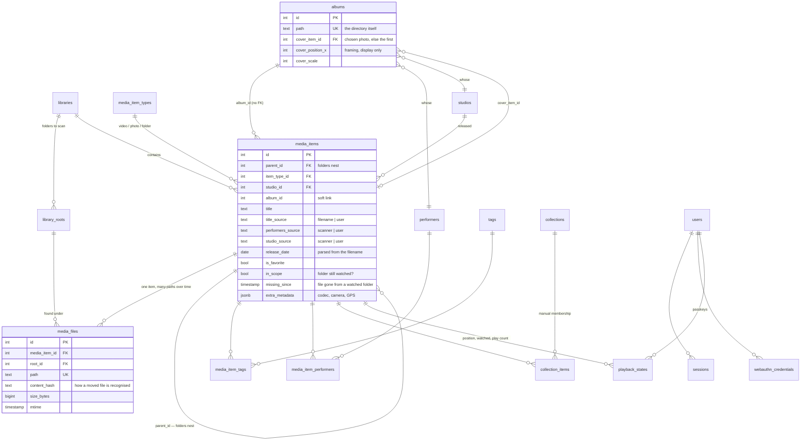

# media-server

A self-hosted media library for a personal video collection, built around one
idea: **your filesystem is the source of truth, and no metadata ever comes from
the internet.**

It scans folders you point it at, works out performers, studios, release dates
and titles from how the files are named and filed, and gives you a browsable
library over the top. Nothing is looked up externally, nothing is uploaded, and
the files themselves are opened read-only.

## Why not Jellyfin

Jellyfin is excellent at what it does. This exists because of three things it
does differently:

- **Libraries are type-locked.** A library is "Movies" or "TV" or "Photos", and
  content can't mix. Here there is one library with a polymorphic `media_items`
  table, so videos, photos and folders coexist and grouping is user-driven.
- **Naming conventions are rigid, and getting them wrong means no metadata.**
  Here the conventions are yours: the scanner reads what it can, never fails a
  file, and never blocks on identifying anything.
- **Organising means fighting the scraper.** With no external source there is
  nothing to fight. The scanner owns a field until you edit it, then it stops
  touching it — permanently.

## What it does

- **Scans** a set of folders you choose, on demand or on an interval
- **Derives** performers, studios, release dates and titles from paths and
  filenames — see [Naming](#naming) below
- **Streams** with HTTP range support, so seeking works
- **Generates** poster frames and multi-segment hover previews with ffmpeg
- **Organises** with tags, favourites, categories, manual and rule-based
  collections, and virtual folders
- **Groups** by performer, studio and album, each with its own browsable page
- **Tracks** watch progress, play counts and a watched state
- **Hides itself** on a keypress — see [Discreet mode](#discreet-mode)
- **Adapts** to how you like it drawn, without a rebuild — see
  [Appearance](#appearance)
- **Backs up** the database and your uploaded artwork to a single archive
- **Survives reorganisation**: files are matched by content hash, so moving or
  renaming one keeps its tags, framing and watch history

## Stack

| Layer | Choice |
|---|---|
| Server | Node 22, TypeScript, Fastify |
| Database | PostgreSQL 17, Drizzle ORM |
| Frontend | React 19, Vite, TanStack Router/Query, Tailwind 4 |
| Media | ffmpeg/ffprobe (probing, posters, previews), sharp (images) |
| Deployment | Docker Compose |

The REST API is documented at `/api/docs` (Swagger UI), and is deliberately a
plain HTTP API rather than a TypeScript-only RPC layer, so other clients can
be written against it.

## Data model

One polymorphic `media_items` table rather than a table per content type —
that's what lets videos, photos and folders sit in one library and be grouped
however you like, instead of being locked into "Movies" or "Photos".



Four decisions worth knowing:

- **`media_files` is separate from `media_items`.** An item is the thing you
  tagged and rated; a file is where it currently lives. Files are matched back
  by `content_hash`, so moving or renaming one on disk keeps everything you
  did to it.
- **`*_source` columns arbitrate ownership.** The scanner writes a field until
  you edit it in the app, then never touches it again. That's what makes "I
  removed this performer" survive a rescan, with no override table.
- **`in_scope` and `missing_since` mean different things.** The first is "you
  stopped watching that folder", the second is "the file vanished from a
  folder we do watch". Conflating them once flagged 273 items as missing.
- **`media_items.album_id` has no foreign key**, deliberately: `albums`
  already points back at `media_items` for its cover, and a hard constraint in
  both directions needs deferred checks for no practical gain.

Not shown, because nothing references them: `scan_jobs`, `categories` and
`app_settings` (a key/JSONB store holding hero picks, scan interval,
appearance and the privacy password hash).

## Running it

Requires Docker and Docker Compose.

```bash
git clone git@github.com:doodlesvee/media-server.git
cd media-server
cp .env.example docker/.env      # then edit it — see below
docker compose -f docker/docker-compose.yml up --build
```

Open <http://localhost:3000>. The first screen creates your account; there is
no default login.

Everything after the clone runs through Docker; nothing needs to be installed
on the host.

### Configuration

`docker/.env` is gitignored and holds the machine-specific paths:

| Variable | Meaning | Default |
|---|---|---|
| `MEDIA_ROOT` | Your library, mounted **read-only** | `./media-placeholder` |
| `HOME_ROOT` | What the in-app folder browser may look at, read-only | `/Users` |
| `BACKUP_DIR` | The one writable mount. Backups are written here, and anything you drop in is offered for restore | `../backups` |
| `COMPOSE_FILE` | Which compose files a bare `docker compose` picks up | — |
| `WEBAUTHN_ORIGIN` | Where the browser thinks it is, for Touch ID | `http://localhost:5173` |

**Set `COMPOSE_FILE` if you develop against this.** Without it a plain
`docker compose up -d` in `docker/` reads the base file alone, which has no
`command:` — the production image supplies one, but the image built for
development is the `deps` stage, whose command is just `node`. The container
starts, exits 0 immediately, and restart-loops with no logs at all, which
looks exactly like the whole app being broken:

```
COMPOSE_FILE=docker-compose.yml:docker-compose.dev.yml
```

Everything else — which folders to scan, scan interval, categories, hero
picks — is configured in the app under **Site settings**, not in env vars.

### Development

Runs the server and Vite in containers with the source bind-mounted:

```bash
npm run dev:docker
```

The web app is then on <http://localhost:5173>, proxying `/api` to the server.

> **On macOS, bind-mounted file changes do not raise inotify events inside the
> container.** `tsx watch` and Vite HMR will not see your edits. Restart the
> affected container after changing server code:
> `docker compose -f docker/docker-compose.yml restart app`.
> This is also why scanning is interval-based rather than using a file watcher.

`node_modules` is a named volume rather than part of the bind mount, so the
host's copy (built for the host's OS and architecture) can't shadow the
Linux-native one — sharp's binary in particular. The cost is that **installing
a dependency takes three steps**: on the host so typechecking sees it, inside
the container so the app can import it, then a restart of both so Vite
re-scans:

```bash
npm install <package> --workspace apps/web
docker compose run --rm --no-deps --entrypoint sh app -c "cd /repo && npm install"
docker compose restart app web
```

Migrations are generated with `npm run db:generate -w apps/server` and applied
automatically on boot.

## Naming

The scanner reads two things: **where a file is** and **what it's called**.
Neither is mandatory — a file with an unhelpful name still imports, plays and
can be organised by hand.

### Folders

```
<library root>/<Performer>/<Studio>/file.mp4
                    │          └── optional: sets the studio for everything inside
                    └── the performer whose collection this is
```

Images in a folder are treated as a **gallery belonging to the video beside
them**, not as separate library items — so a scene and its stills stay
together.

### Filenames

The declared convention, opted into by a **leading `[`**:

```
[Studio] Performer 1, Performer 2 - MM.DD.YYYY - Video title.mp4
```

Everything in it is optional except the studio bracket. A filename that
doesn't start with `[` is read the older, looser way: the folder names the
performer, and a `[Bracket]` anywhere supplies the studio.

Because you typed the brackets and commas deliberately, names inside them are
trusted literally — which is what makes it safe to create performers from a
filename without guessing. It also means **a video with two performers needs
only one file**; listing both credits it to both.

Release dates are read as `MM.DD.YYYY` or `YYYY.MM.DD`, told apart by which end
carries the four-digit year. Two-digit years are ignored rather than guessed at.

Where two sources disagree, the more deliberate one wins:

1. what you edited by hand in the app — permanently
2. a leading `[Studio]` in that specific file's name
3. the `<Studio>/` folder
4. a `[Bracket]` elsewhere in the filename

## Discreet mode

`Ctrl/Cmd + Shift + H` blurs every image in the app, from any page, instantly.
Press it again and it asks for proof before letting go — a **privacy password**
or **Touch ID**, whichever you've set up under Site settings → Privacy.

The asymmetry is the point: arming it is free and immediate, because you press
it when someone walks in. Releasing it costs something, because otherwise
anyone at the screen just presses it back.

- The **privacy password is separate from your account password** on purpose:
  this one gets typed in front of whoever made you press the key. Setting or
  clearing it needs your account password, which is also the way back if you
  forget it.
- **Touch ID** is WebAuthn with a platform authenticator. Your fingerprint
  never leaves the machine — only a signature over a one-time challenge does,
  and there's nothing biometric in the database to leak. It needs a secure
  context, so it works over `localhost` but not over plain HTTP by IP.
- Five wrong password attempts buys a 60-second wait, and each further wrong
  guess re-arms it.
- Optionally it blurs **names** too. A blurred picture with the performer and
  studio legible underneath hides less than it looks like it does.

**What it is honestly worth:** a blur drawn by your browser. It defeats a
glance over your shoulder. It does not defeat developer tools, clearing site
data, or anyone with real access to your unlocked machine.

## Appearance

`Ctrl/Cmd + Shift + ,` opens a panel over whatever page you're on — tile size,
what a tile writes on itself, banner height, whether hovering expands a tile
and whether it plays a preview clip. It's deliberately not a settings page:
these are choices you can only judge by looking at them, and the page behind
the panel resizes as you drag.

Settings are stored server-side, so one look follows you between browsers. The
browser keeps a copy too, read synchronously, so a reload paints correctly
instead of flashing the defaults.

Which sections the homepage has, and in what order, lives under Site settings →
Homepage — it's a layout decision made once, not a slider.

## Keyboard

| | |
|---|---|
| `Ctrl/Cmd + K` | Search anywhere — performers, studios, titles, as you type |
| `Ctrl/Cmd + Shift + H` | Discreet mode on, or off with proof |
| `Ctrl/Cmd + Shift + ,` | Appearance panel |
| `Space` / `K` | Play or pause |
| `←` `→` | Skip 10 seconds |
| `↑` `↓` | Volume |
| `F` / `M` | Fullscreen / mute |
| `Esc` | Close the innermost thing that's open |

The full list, including search and editing, is at `/help` in the app. Single-
key shortcuts are ignored while you're typing, so a space in a title stays a
space rather than pausing a video.

## Backups

**Back up now** in Site settings writes a single `.tar.gz` containing a full
`pg_dump` and every image you've uploaded. Posters, previews and generated
thumbnails are deliberately excluded — they're regenerable from your videos,
and including them would take a backup from a few MB to tens of GB, which in
practice means it stops being run.

### Restoring

**Restore** sits next to each archive in the same panel. It replaces the whole
library — database and uploaded images — and signs you out, because the account
comes from the backup too. The app doesn't need to be stopped: it gates
incoming requests, stops its own scan timer, swaps the database, and then
applies any migrations the archive predates.

Confirming it means typing the archive's date, so picking the wrong one out of
ten near-identical filenames is caught before rather than after. If a privacy
password or passkey is set, restoring also asks for it — the same credential
that guards the missing-videos manager. A fresh install has no credential to
ask for, which is what keeps it recoverable.

Three things make it safe to say yes to:

- **A snapshot of the current library is taken first**, so a restore can be
  undone by restoring that snapshot. The panel names it afterwards.
- **The archive you restore *from* is never pruned** to make room for that
  snapshot. It used to be possible for the newest-10 rule to quietly delete the
  known-good archive someone was reaching for.
- **A failed restore changes nothing.** The dump is applied in a single
  transaction, so an interrupted or corrupt one rolls back whole and the
  library is exactly as it was.

A backup taken by a *newer* version of the app is refused rather than applied.
Drizzle's migrator compares the local migration list against the database's
newest recorded migration, so a database already past every migration the code
knows about silently matches none of them and reports success — leaving the app
querying a schema it no longer models. Each archive records the version that
wrote it so that case can be caught up front.

### Moving to another machine

`BACKUP_DIR` is a bind mount, so an archive is visible to the app as soon as
it's in that folder:

1. `git clone`, and copy the `.tar.gz` into `backups/`.
2. Point `MEDIA_ROOT` at the videos and `docker compose up`.
3. Create any account — it's thrown away in a moment — to get past the
   first-run screen.
4. Site settings → Backup → **Restore** on that archive.
5. Sign in with the password you had when the backup was taken.
6. Run a scan. Files are matched back to their existing records by content
   hash, not by path, so a different folder layout doesn't create duplicates —
   tags, collections, favourites, watch progress and anything you edited by
   hand stay attached. Values the scanner derived from the *old* path (an
   auto-titled item, its performers, its studio) are re-derived from the new
   one. Poster frames and preview clips are rebuilt at the same time.

`scripts/restore.sh` is still there for when the app won't start — it does the
same thing from outside the container, with Postgres up and the app stopped.

A backup only protects you if it leaves the machine — point `BACKUP_DIR` at an
external drive or a synced folder.

## Formats

Scanned: `mp4` `mkv` `avi` `mov` `webm` `m4v` `f4v` `wmv`, and `jpg` `jpeg`
`png` `gif` `webp` `heic`.

Everything scannable gets a poster and a hover preview, because ffmpeg reads
far more than a browser plays. **Playback is direct-play only** — there is no
transcoding. Where a file's container or codec won't play in a browser (an
H.264 MKV, say, or VC-1 in WMV), the detail view says so and names which of the
two is the problem, since a container needs only a fast remux while a codec
needs a full re-encode.

## Status

Built for one person's library and used daily against it. There is no
multi-user support, no transcoding, and no mobile app. The API is stable enough
to build against but not versioned.
